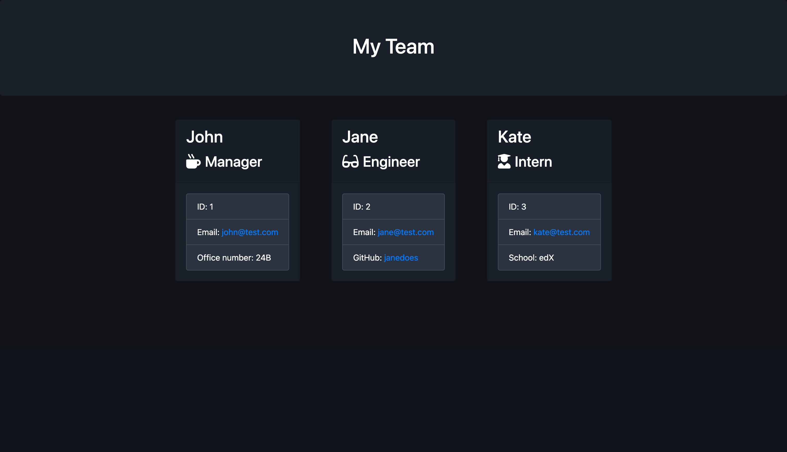

# Team Profile Generator
  
  
  ## Description

  This Node.js application is designed to efficiently gather and organize data on members of a software engineering team, and subsequently generate a visually appealing HTML webpage that presents a summary of each team member in the form of a card. It also ensures that all code components pass the provided tests.

  ### Table of contents

  * [Technologies](#technologies)
  * [Installation](#installation)
  * [Usage](#usage)
  * [License](#license)
  * [Contributing](#contributing)
  * [Tests](#tests)
  * [Questions](#questions)

  ## Technologies

  This project is created with:
  * 
  * 
  * 
  * 
  * 

  ## Installation
  
  To install, run the following commands:

  1. Clone this repo to your local environment:
  ```
  git clone https://github.com/agh911/Team-Profile-Generator.git
  ```

  2. Install NPM packages
  ```
  npm i
  ```

  ## Usage

  The following shows the application's functionality:
  * In Terminal
  
  * Generated HTML 
  

    Navigate to a more thorough demonstration by clicking [this link](https://drive.google.com/file/d/1pqXp9IGXF1e78YrUzyciNHVhxRF3Rq7l/view?usp=sharing) which will take you to a video. 

  ## License

  This project is licensed under the MIT License.

  ## Contributing

  Do you have any suggestions? To contribute to this repo, follow the nest few steps:
  1. Fork the project (https://github.com/agh911/Team-Profile-Generator)<br>
  2. Create a new branch - `git checout -b feature/branch_name`<br>
  3. Commit your code on a separate branch - `git commit -m 'adds new feature'`<br>
  4. Push to the branch - `git push origin feature/branch_name`<br>
  5. Open a new Pull Request
  
  I will do my best to review your suggestion(s) in due time and merge it if all is well.

  ## Tests

  To run tests, run the following command:
  ```
  npm test
  ```

  ## Questions

  If you have any questions about this repository, open an issue or contact me directly at [andreeaghenea98@yahoo.com](mailto:andreeaghenea98@yahoo.com). You can also reach me on GitHub and find more of my work at [agh911](https://github.com/agh911).

  #### [Back to top](#team-profile-generator)
  ---
  Copyright © 2023, Andreea Ghenea
